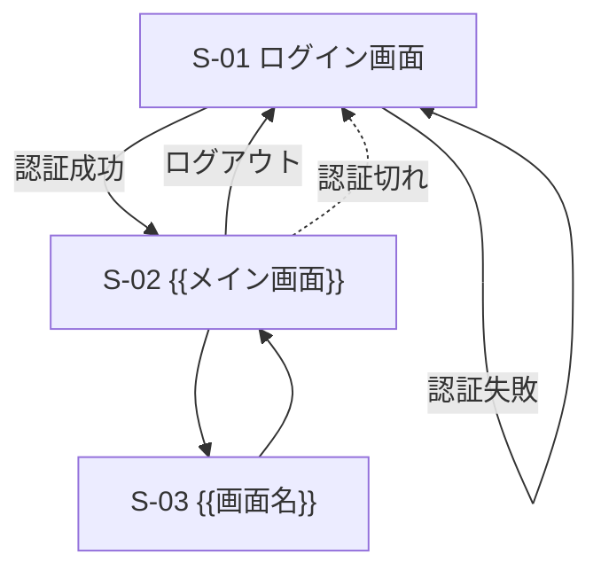

<!-- 機能ID=F-連番、画面ID=S-連番で一貫させる。ログイン画面はテンプレート既定。 -->
<!-- 受け入れ基準は AI が「完成」を自己判定する検証基準。Given-When-Then で漏れなく書く。 -->
<!-- 一覧・基準は表、遷移は Mermaid。行は増減可。 -->

# 機能要件

{{アプリ名}} が提供する機能・受け入れ基準・画面構成を定義する。

## 機能一覧

| ID | 機能名 | 区分 | 概要 | 対応画面 |
|----|--------|------|------|----------|
| (例) F-01 | 実績登録 | 必須 | 日次実績の入力・保存 | S-02 |
| F-00 | ログイン / ログアウト | 必須 | 共通認証基盤による認証（テンプレート既定） | S-01 |
| F-01 | {{機能名}} | 必須 | {{概要}} | {{画面ID}} |
| F-02 | {{機能名}} | 必須 | {{概要}} | {{画面ID}} |
| F-03 | {{機能名}} | オプション | {{概要}} | {{画面ID}} |

## 受け入れ基準

<!-- 各機能の合格条件。Given-When-Then の1行で1条件。全て満たせば完成とみなす。 -->
<!-- この基準が AI 実装時の答え合わせ・Definition of Done の源泉になる。 -->

| 機能ID | ID | Given（前提） | When（操作） | Then（期待結果） |
|--------|----|--------------|-------------|-----------------|
| (例) F-01 | AC-01 | ログイン済みで実績未登録 | 必須項目を入力し保存 | 一覧に登録内容が表示される |
| F-00 | AC-00 | 未ログイン状態 | 認証が必要な画面にアクセス | ログイン画面にリダイレクトされる |
| F-01 | AC-01 | {{前提}} | {{操作}} | {{期待結果}} |
| F-01 | AC-02 | {{前提}} | {{異常系の操作}} | {{エラー表示・処理中断}} |
| F-02 | AC-03 | {{前提}} | {{操作}} | {{期待結果}} |

## 画面一覧

<!-- S-01 ログイン, S-99 エラー(404/500) はテンプレート既定。残りを埋める。 -->

| ID | 画面名 | 概要 | 対応機能 | 認証要否 |
|----|--------|------|----------|----------|
| S-01 | ログイン画面 | 認証情報の入力（テンプレート既定） | F-00 | 不要 |
| S-02 | {{画面名}} | {{概要}} | {{機能ID}} | 要 |
| S-03 | {{画面名}} | {{概要}} | {{機能ID}} | 要 |
| S-99 | エラー画面 | 404 / 500 表示（テンプレート既定） | － | 不要 |

## 画面遷移図

<!-- ログイン→メインの遷移はテンプレート既定。{{画面名}} を実画面に置換。 -->

