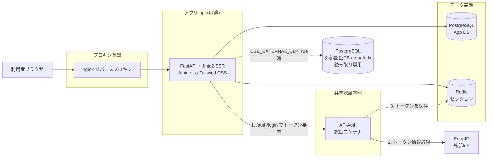
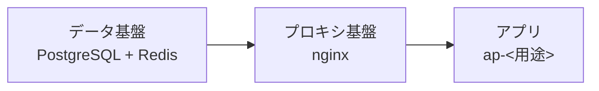
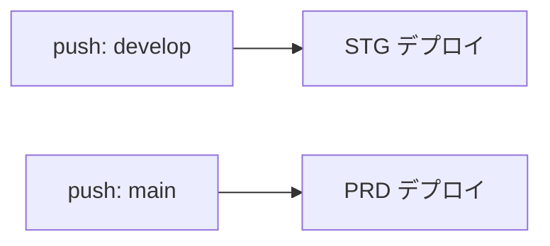
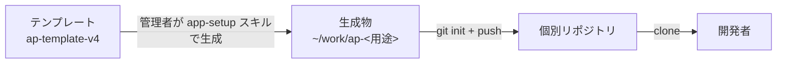

# システム構成

<!-- {{アプリ名}} {{用途}} を自アプリの値に置換する。技術スタック・環境構成の既定値は事実。変更時はADR必須。 -->

{{アプリ名}} のシステム全体構成・技術スタック・環境・CI/CD・リポジトリ運用を定義する。

## 全体構成図

全コンテナは共有ネットワーク `shared_backend`（external）に接続する。App DB は Alembic マイグレーション対象、外部認証DB ap-safedx は参照専用でスキーマ変更しない。

認証は共有基盤の AP-Auth コンテナが担う。本アプリの `/auth/login` が AP-Auth へトークンを要求し、AP-Auth が EntraID から取得したトークンを Redis に保存する。アプリは Redis のセッションを参照して認証状態を判定する。

## 技術スタック

<!-- 下表はテンプレート既定。覆す場合は adr/ に新規ADRを追加し、本表を更新する。 -->

| 分類 | 技術 | 備考 |
|---|---|---|
| Webフレームワーク | FastAPI | Python |
| 画面 | Jinja2 SSR + Alpine.js + Tailwind CSS | サーバーサイドレンダリング |
| 認証 | AP-Auth コンテナ + EntraID（外部IdP） | トークンは Redis に保存。`/auth/login` 経由で認証 |
| ORM / マイグレーション | SQLAlchemy + Alembic | App DB のみ対象 |
| アプリDB | PostgreSQL | 本アプリ固有データ |
| 外部認証DB | PostgreSQL（ap-safedx） | 読み取り専用・ユーザー情報参照（任意連携） |
| セッション | Redis | TTL は SESSION_TTL_HOURS |
| リバースプロキシ | nginx | プロキシ基盤 |
| 実行基盤 | Docker Compose | ネットワーク shared_backend |

技術選定の根拠は [adr/0001_技術スタック(テンプレート既定).md](adr/0001_技術スタック(テンプレート既定).md) を参照。

## 環境構成

| 環境 | ENV_TYPE | 設定ファイル | 用途 | デプロイ |
|---|---|---|---|---|
| DEV（ローカル） | DEV | .env.DEV | 開発者ローカル・検証 | 手動 |
| ステージング | STG | .env.STG | リリース前確認 | develop push で自動 |
| 本番 | PRD | .env.PRD | 本番運用 | main push で自動 |

環境切替は `ENV_TYPE` と `.env.<ENV>` で行う。秘密情報は GitHub Secrets / Variables で管理し、self-hosted runner が `.env.<ENV>` を生成する。平文はデプロイ後に保持しない。

## 起動順序

逆順で起動すると `network shared_backend not found` になる。事前に `docker network create shared_backend` を実行する。

## CI/CD フロー

GitHub Actions（self-hosted runner）で実行する。develop / main への push をトリガーに Self-Hosted Runner + GitHub Actions が自動デプロイする。DEV はローカルで手動デプロイする。ブランチ運用は develop→STG / main→PRD。

## リポジトリ運用の流れ

テンプレートリポジトリへは push しない。管理者が個別リポジトリを用意し、開発者はそれを clone して開発する。一方向の流れを保つ。
