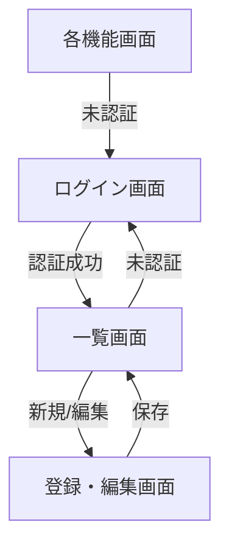

# 画面設計書

<!-- 画面ごとに「画面詳細」節を複製する。ワイヤーフレームは images/ に画像を置き相対パスで貼る。 -->

{{アプリ名}} の画面構成・遷移・レイアウトを定義する。SSR（Jinja2）+ Alpine.js + Tailwind CSS。

## 画面遷移図

ログイン成功後に各機能画面へ遷移する。未認証時は全画面がログイン画面へリダイレクトされる。

## 画面一覧

| 画面ID | 画面名 | パス | 概要 | ロール |
|---|---|---|---|---|
| （例）S-00 | ログイン画面 | `/auth/login` | 認証 | 全員 |
| （例）S-01 | アイテム管理画面 | `/example/` | アイテムの一覧・登録・編集・削除 | 一般 / 管理者 |
| {{画面ID}} | {{画面名}} | {{パス}} | {{概要}} | {{ロール}} |

## 共通レイアウト

全画面が `base.html` を継承する。共通部品は `templates/components/` に配置。

| 要素 | ファイル | 内容 |
|---|---|---|
| マスターレイアウト | `base.html` | ヘッダー・サイドバー・コンテンツ枠の骨格 |
| ヘッダー | `components/_header.html` | アプリ名・ログインユーザー・ログアウト |
| サイドバー | `components/_sidebar.html` | 機能へのナビゲーション（機能追加時にリンクを追加） |
| ページネーション | `components/_pagination.html` | 一覧のページ送り |
| エラー画面 | `errors/404.html` / `errors/500.html` | 未検出・サーバーエラー |

- デザイントークン・共通UI部品は `app/static/css/`(Tailwind)と `templates/components/` を正とする。
- レスポンシブ対応方針は 01_要件定義/04_非機能要件.md に従う。

## 画面詳細

<!-- 以下のブロックを画面ごとに複製する。 -->

### {{画面名}}

- パス: {{パス}}
- 目的: {{画面の役割}}
- 表示条件: {{認証・ロール・データ有無などの表示前提}}

構成要素

| 領域 | 要素 | 表示条件・挙動 |
|---|---|---|
| {{領域}} | {{ボタン/入力/一覧等}} | {{活性条件・遷移先}} |

- ワイヤーフレーム: `images/{{画面ID}}.png`

## （例）アイテム管理画面

- パス: `/example/`
- 目的: アイテムの一覧表示と登録・編集・削除
- 表示条件: 認証済みユーザーのみ。未認証はログイン画面へリダイレクト

構成要素

| 領域 | 要素 | 表示条件・挙動 |
|---|---|---|
| ヘッダー行 | 検索ボックス・新規作成ボタン | 常時表示 |
| 一覧 | アイテム表（名前・カテゴリ・状態） | 論理削除分は非表示、ページネーション付き |
| 行操作 | 編集・削除ボタン | 認証済みユーザーに活性 |
| モーダル | 登録・編集フォーム | 新規/編集時に Alpine.js で開閉 |

- ワイヤーフレーム: `images/S-01.png`
