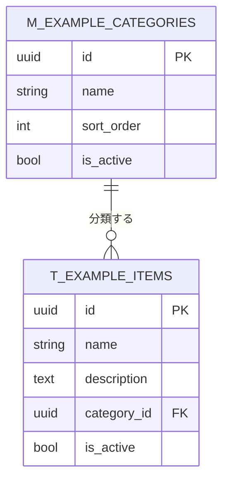

# データベース論理設計書

<!-- 論理設計のみを扱う。物理設計（型・制約・索引）は 03_詳細設計/02_テーブル定義.md へ。 -->
<!-- スキーマの正は Alembic マイグレーション。本書はエンティティと関連の意図を説明する。 -->

{{アプリ名}} のエンティティと関連を定義する。

## 命名規則

| 区分 | 接頭辞 | 基底クラス | 例 |
|---|---|---|---|
| マスタ | `m_` | `Base` + `TimestampMixin` | `m_example_categories` |
| トランザクション | `t_` | `Base` + `TimestampMixin` | `t_example_items` |
| 外部参照（認証基盤） | 規定なし | `ExternalBase` | `m_department` |

- 全テーブルに `TimestampMixin`（作成・更新・削除の日時と操作者）を付与する。
- 削除は論理削除。`deleted` フラグで表現し、物理削除しない。
- 主キーは UUID を既定とする（外部参照テーブルを除く）。
- 外部参照テーブルは認証基盤 DB（safedx_db）を参照し、Alembic の管理対象外。

## ER図

example のマスタ・トランザクション関係を示す。

<!-- 業務エンティティを追加する場合はこの ER 図に追記する。 -->

## エンティティ一覧

| エンティティ | テーブル名 | 区分 | 概要 | 主な関連 |
|---|---|---|---|---|
| （例）カテゴリマスタ | `m_example_categories` | マスタ | アイテムの分類 | アイテムを1対多で持つ |
| （例）アイテム | `t_example_items` | トランザクション | 管理対象のアイテム | カテゴリに属する |
| アプリ設定 | `m_app_settings` | マスタ | キー・バリューの設定値 | なし |
| 部署（外部参照） | `m_department` | 外部参照 | 認証基盤の部署 | 参照のみ |
| {{エンティティ}} | {{テーブル名}} | {{区分}} | {{概要}} | {{関連}} |

## 正規化・非正規化の方針

- 原則第3正規形。参照整合性は外部キーで担保する。
- 意図的に非正規化した箇所は理由を明記する。
  - {{非正規化した項目と理由。無ければ「該当なし」}}
- データディクショナリ（用語と物理名の対応）は 02_基本設計/02_用語集.md と整合させる。
