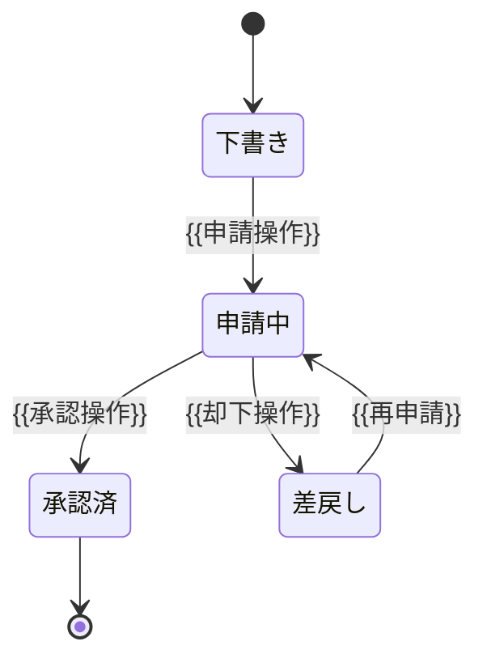
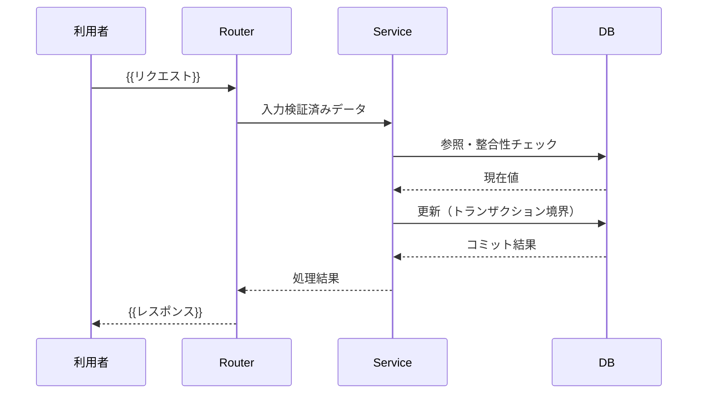

<!-- {{ }} を自アプリの値に置換。(例)行は削除。 -->
<!-- 全機能分は書かない。下の選定基準に該当する機能のみ本書に記す。 -->
<!-- 該当しない機能はコードとテストコードを詳細設計の正とする。 -->

# 処理設計

複雑・致命的な処理のみ事前設計し、それ以外はコードとテストを正とする方針を定める。

## 方針

- 詳細設計書は網羅的に書かない。外部仕様（基本設計）と受け入れ基準を AI に渡してコード生成し、生成された**コードとテストコードを詳細設計の正**とする。
- 設計書とコードの乖離を避けるため、以下の選定基準に該当する処理のみ本書に事前記載しレビューする。
- 本書に記載しない機能は、基本設計の外部仕様・受け入れ基準・単体テスト観点表を根拠に実装する。

## 事前設計の対象選定基準

<!-- 各機能を下の基準で判定し、1つでも該当すれば本書に処理を記す。 -->

| 基準 | 該当例 | 事前設計 |
|------|--------|----------|
| 金額・料率・数量の計算を伴う | 請求額算出、按分、丸め処理 | 必須 |
| 状態遷移がある | 申請→承認→完了、下書き→公開 | 必須 |
| 複数テーブル横断の整合性が必要 | 在庫引当、二重登録防止 | 必須 |
| 誤りが業務・法務上致命的 | 権限判定、個人情報の開示範囲 | 必須 |
| 単純 CRUD・一覧・画面表示 | example 機能相当 | 不要（コードを正とする） |

## 処理フロー雛形

<!-- 対象機能ごとに複製。分岐・例外を明示する。 -->

```mermaid
flowchart TD
    A[開始: {{入力・トリガー}}] --> B{{{条件: バリデーション}}}
    B -- NG --> E[エラー応答: {{エラー内容}}]
    B -- OK --> C[処理: {{主処理}}]
    C --> D{{{条件: 業務ルール}}}
    D -- 不成立 --> E
    D -- 成立 --> F[永続化・応答: {{結果}}]
```

## 状態遷移雛形

<!-- 状態を持つ機能のみ。遷移条件と禁止遷移を明示する。 -->



## シーケンス雛形

<!-- 外部サービス・複数層をまたぐ処理のみ。トランザクション境界を注記する。 -->



## 例外処理一覧

<!-- 上記対象機能の異常系を列挙。HTTP ステータスと対応を対で書く。 -->

| ID | 発生条件 | 応答 | 対応 |
|----|----------|------|------|
| (例) EX-01 | 対象レコード不存在 | 404 | エラーメッセージ表示 |
| EX-01 | {{異常条件}} | {{ステータス}} | {{対応}} |
| EX-02 | {{異常条件}} | {{ステータス}} | {{対応}} |
