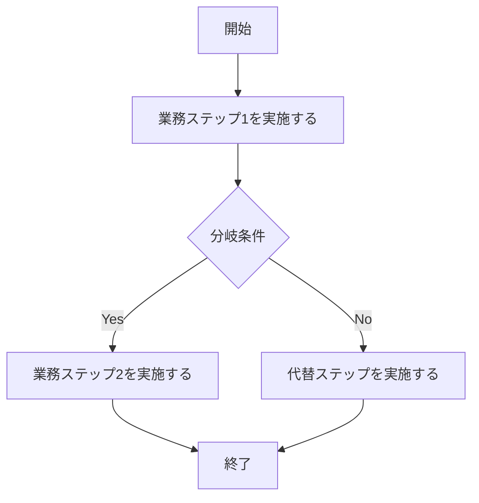

# 要件定義書テンプレート(社内システム開発)

案件未定のため、以下は記入例と記入用テンプレートである。案件が決まり次第、テンプレート側の各項目を埋めて使う。用語は docs/project/03_glossary.md と一致させる。

## 利用者像(ペルソナ)
> 主要な利用者を役割ごとに1行で書く。ITリテラシーと利用頻度が、画面設計とマニュアルの難易度を決める。

| 役割 | 主な業務 | ITリテラシー | 利用頻度 | 利用環境 |
| --- | --- | --- | --- | --- |
|  |  |  |  |  |

記入例

| 役割 | 主な業務 | ITリテラシー | 利用頻度 | 利用環境 |
| --- | --- | --- | --- | --- |
| 総務担当 | 備品の貸出受付・台帳管理 | Excel中心。新しい画面には抵抗がある | 毎日 | 事務所PC(Chrome) |
| 一般社員 | 備品を借りる・返す | ばらつきが大きい。最小操作を前提にする | 月2〜3回 | 社内PC・スマホ |

## ユーザーストーリー一覧
> ID・ストーリー・優先度(高/中/低)を表で書く。全ストーリーを1行ずつ列挙する。

| ID | ストーリー | 優先度 |
| --- | --- | --- |
| US-01 |  |  |

記入例: 備品を検索して借りる

| ID | ストーリー | 優先度 |
| --- | --- | --- |
| US-01 | 社員として、備品を名称で検索し在庫状況を確認したうえで借りたい。手元の備品を探す手間をなくすため。 | 高 |

### US-01 の受け入れ条件

**US-01-S1: 在庫がある備品を検索して借りる**
- Given: 備品マスタに「ドライバーセット」が登録され、貸出中でない
- When: 社員が検索欄に「ドライバー」と入力して検索する
- Then: 検索結果に「ドライバーセット」が表示され、貸出ボタン押下で貸出中ステータスに変わる

**US-01-S2: 貸出中の備品を検索する**
- Given: 備品マスタの「ドライバーセット」が貸出中である
- When: 社員が検索欄に「ドライバー」と入力して検索する
- Then: 検索結果に「貸出中」と表示され、貸出ボタンは押せない

## 各ストーリーの受け入れ条件
> ストーリーごとに Given(前提の状態)/ When(操作)/ Then(期待する結果)の3行でシナリオを書く。正常系と異常系の両方を書き、そのままテスト項目に転記できる粒度にする。シナリオには `US-XX-S1` 形式の番号を振る(テスト名に埋めて網羅チェックを機械化するため)。

### US-01 の受け入れ条件
> シナリオ名・Given・When・Then を書く。ストーリーの数だけこの見出しを追加する。

## 非機能要件
> 同時利用者数・バックアップ・権限の3点を必ず数字と役割で書く。

### 同時利用者数
> ピーク時に同時アクセスする人数を書く(例: 総務担当2名+申請社員が同時に10名アクセスする)。

### バックアップ
> バックアップの頻度・保持期間・復旧目標時間(RTO)を書く(例: 日次バックアップ、30日保持、RTO4時間)。

### 権限
> 役割ごとの操作可否をマトリクスで書く。

| 役割 | 閲覧 | 登録 | 承認 | 削除 |
| --- | --- | --- | --- | --- |
| 一般利用者 |  |  |  |  |
| 担当部門 |  |  |  |  |
| 管理者 |  |  |  |  |

## 業務フロー
> 主要業務の一連の流れを Mermaid の flowchart で書く。分岐条件も明示する。

## 利用部門への確認事項
> 自分で決められない業務ルール・判断基準を列挙する。勝手に仮定しない。

- 
