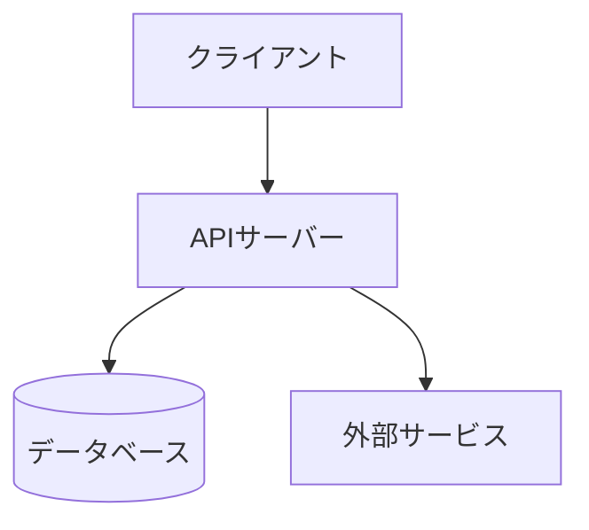
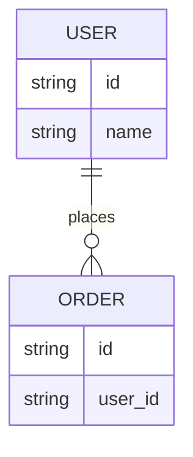

# 基本設計書

案件名・対象システム名は着手時に記入する。本書は雛形であり、内容は空欄のまま使わない。

## 構成図

> システム全体のコンポーネント構成をMermaidで書く。クライアント・API・DB・外部サービスの接続関係を含める。

## ER図

> 主要エンティティと関連をMermaidで書く。ここではキーと関連のみ書き、カラム定義・制約(NOT NULL・一意・外部キー)の正本はマイグレーションファイルとする(governance.md の正本形式に従う)。

## API仕様

> 正本は OpenAPI 定義(`docs/project/api/openapi.yaml`)とする。ここにはエンドポイント一覧のみ書き、リクエスト/レスポンスの詳細はOpenAPIに書く。結合テストの契約(期待値)と母数「エンドポイント数×代表ケース」はここから導く。

| メソッド | パス | 概要 | 主なステータスコード |
|---|---|---|---|
| POST | /orders | 注文を登録する | 201 / 400 / 409 |

## DB定義・マイグレーション

> マイグレーション手段とDBアクセス方式を書く。結合テストのGiven(DBコンテナへの状態準備)がこの節だけで再現できることを基準にする。スキーマ制約の母数はマイグレーションファイルから数え、マイグレーションは結合テスト(Red)より先に作成する。

- マイグレーション手段(例: Alembic / Flyway):
- DBアクセス方式(例: ORM名 / 生SQL):
- テスト用DB初期化手順(例: マイグレーション全適用→テストデータ投入):
- テストケース間のデータ分離・クリーンアップ方針(ai-driven-dev-lifecycle.md 6.4節の二択から選ぶ。例: テストごとにトランザクションをロールバック / スイートごとにコンテナ・スキーマを使い捨て):
- テスト用DBの接続方法(例: 環境変数 `DATABASE_URL`。変数名とテスト時の既定値を書く):

## 認証・権限方式

> 認証方式(例: OIDC/セッション/APIキー)と権限モデル(例: RBAC)を具体名で書く。

## インフラ構成

> 実行環境(例: Vercel/AWS ECS)とマネージドサービスの利用範囲を書く。自前運用が必要な部分は理由も添える。

## 外部連携

> 連携先サービス名、通信方式(REST/Webhook等)、認証方式に加え、主な要求/応答(または仕様書リンク)と障害時の期待挙動(タイムアウト・リトライ方針)を一覧で書く。結合テストで外部サービスをモックする際の期待値はこの一覧を正とする。
