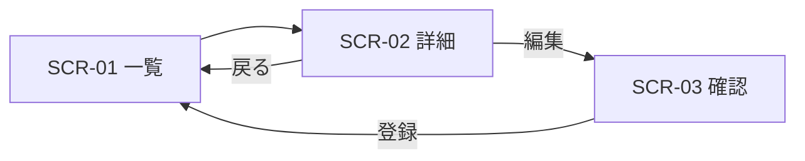

# 画面設計書

案件未定のテンプレートである。プロジェクト開始時に画面一覧・画面遷移図・決定メモを埋めて使う。装飾より項目の並び順とデフォルト値を優先して検討する。

## 目次

1. 画面一覧
2. 画面遷移図
3. 決定メモ
4. 利用部門レビュー観点

## 1. 画面一覧

> ID・画面名・目的・主要項目・利用者を1画面1行で書く。主要項目は入力順に並べる。

| ID | 画面名 | 目的 | 主要項目 | 利用者 |
| --- | --- | --- | --- | --- |
| SCR-01 |  |  |  |  |
| SCR-02 |  |  |  |  |
| SCR-03 |  |  |  |  |

## 2. 画面遷移図

> 画面IDをノードにして矢印でつなぐ。分岐条件は矢印のラベルに書く。

## 3. 決定メモ

> 採用した案と不採用案を1行ずつ、決めた理由とセットで書く。

- 決定:
  - 理由:
- 不採用案:
  - 却下理由:

## 4. 利用部門レビュー観点

> 利用部門が確認する項目を質問形式で並べる。

- この画面だけで業務が完結するか
- 入力必須項目に迷いがないか
- デフォルト値は現場の実データと一致するか
- 一覧から目的の行へ何クリックで到達するか
- 削除・確定など誤操作から復帰できるか

## 記入例

SCR-01 備品検索画面

| ID | 画面名 | 目的 | 主要項目 | 利用者 |
| --- | --- | --- | --- | --- |
| SCR-01 | 備品検索画面 | 在庫中の備品を検索し貸出可否を確認する | 検索キーワード・カテゴリ・在庫状態・検索結果一覧・貸出ボタン | 総務部担当者、一般社員 |

- 決定: 検索条件をキーワード1つとカテゴリのプルダウンに絞る
  - 理由: 総務部の実利用ログで複合条件検索は月2件のみ。単純な条件で入力速度を優先する
- 不採用案: 詳細検索フォーム(条件10項目)を常時表示する案
  - 却下理由: 初期表示が長くなり、対象ユーザーの8割を占める一般社員が迷う

レビュー観点への回答例:
- この画面だけで業務が完結するか → 完結しない。貸出確定はSCR-03で行う
- デフォルト値は現場の実データと一致するか → カテゴリの初期値を「全て」にし、絞り込み忘れによる検索結果0件を防ぐ

