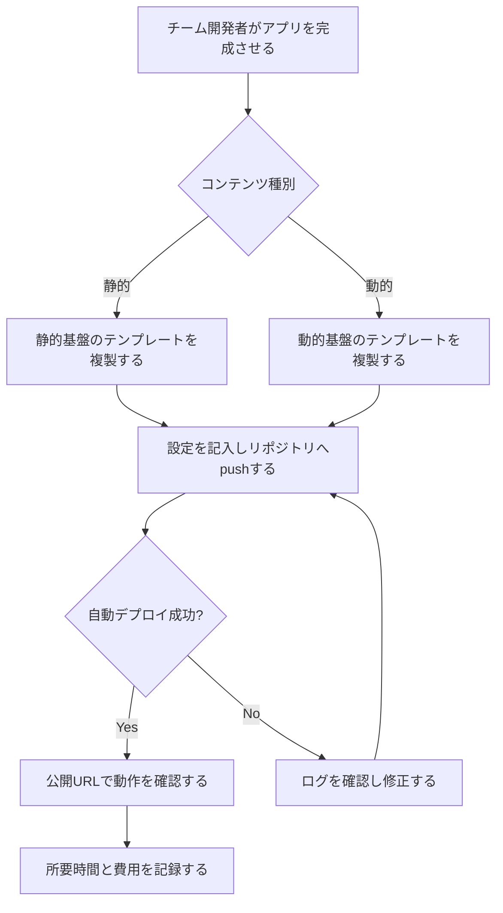

# 要件定義書: Azureアプリ公開基盤(検証フェーズ)

用語は docs/project/03_glossary.md と一致させる。本書の前提は docs/project/01_prd.md(企画書)にある。

## 前提条件

- 基盤はAzure上の社内閉域網内に構築する。パブリックネットワークへの公開は行わない
- 公開URLへのアクセスは社内プライベートネットワークからに限る
- デプロイはGit push起点の自動デプロイとする。手動デプロイは行わない
- 基盤の各リソースはすべてプライベートネットワーク構成とし、社内の既存VNetに接続する
- カスタムドメインのSSL証明書はApp Service証明書を利用する
- 本検証の成果物は基盤テンプレート2種(静的・動的)と現行VM運用との実測比較である。検証アプリ3本は評価用であり、保守しない
- 認証は基盤の組み込み認証(Easy Auth)+Microsoft Entra IDを利用する。認証コンポーネントは自作しない(ADR-0002)
- 閉域網(VNet)からGitHub.comへの外向きHTTPSは許可されている。インバウンドの開放はしない
- 公開URLはアプリ別サブドメイン方式(環境の区別はハイフンで同一階層)とし、ワイルドカード証明書1枚で賄う。親ドメインの実名は本番展開時に確定する(文書上はexample表記)

## 目指す体験(参考イメージ)

設計判断で迷ったときの方向付けに使う参考イメージ。ゴールや受け入れ判定の基準にはしない。本検証のゴールは、テンプレートからAzure上に環境一式を短時間で用意できることに置く。

- 静的基盤: GitHub Pagesのように、リポジトリを用意してpushすれば公開URLが得られる
- 動的基盤: Vercelのように、pushだけでビルドからデプロイまで進む。データベースはTursoのように、アプリ追加時に小さくすぐ用意できる(本件では共有PostgreSQL内にアプリ別データベースを切る)
- この体験の完全な再現は求めない。テンプレートと手順で、環境構築から公開までの手数を減らすことを優先する。基準は検証マイルストーンの合格ライン(1件あたり1時間以内(仮))とする

## 利用者像(ペルソナ)

| 役割 | 主な業務 | ITリテラシー | 利用頻度 | 利用環境 |
| --- | --- | --- | --- | --- |
| チーム開発者 | AI駆動開発で作ったアプリのデプロイ・更新。検証中は起案者1名 | Docker・Git・Azureを日常的に使う | 週数回(検証期間中) | 社用PC(Git・Azure CLI) |
| 基盤管理者 | 基盤テンプレートの整備、費用と稼働の記録。起案者が兼ねる | Azureのリソース管理と課金確認ができる | 週数回 | 社用PC(Azureポータル・Azure CLI) |
| アプリ利用者 | 公開された検証アプリをブラウザで使う。将来は最大500名程度 | ばらつきが大きい。URLを開く以上の操作を求めない | 検証中に随時 | 社内PC(ブラウザ、閉域網内) |

## ユーザーストーリー一覧

静的基盤と動的基盤は設計を分けて進める(基本設計・ADRは基盤別に作る)。要件の正本は本書1本とし、対象基盤の列で区別する。

| ID | ストーリー | 対象基盤 | 優先度 | 段階 |
| --- | --- | --- | --- | --- |
| US-01 | チーム開発者として、静的基盤のテンプレートから静的サイトを公開したい。VM上の初期構築なしで公開するため。 | 静的 | 高 | 第1段 |
| US-02 | チーム開発者として、動的基盤のテンプレートからPythonアプリを公開したい。 | 動的 | 高 | 第1段 |
| US-03 | チーム開発者として、動的基盤のテンプレートからNext.jsアプリを公開したい。 | 動的 | 高 | 第1段 |
| US-04 | チーム開発者として、公開済みアプリの変更をGit pushだけで反映したい。更新のたびのVM作業をなくすため。 | 共通 | 高 | 第2段 |
| US-05 | チーム開発者として、動的基盤のアプリからPostgreSQLを利用したい。現行構成のDB利用を代替できるか確かめるため。 | 動的 | 中 | 第1段 |
| US-06 | 基盤管理者として、新規公開1件の所要時間と2基盤の月額費用を実測し、現行VM運用と比較したい。本番展開の判断材料にするため。 | 共通 | 高 | 第1段 |
| US-07 | アプリ利用者として、M365アカウントのSSOで公開されたアプリ・静的サイトにログインしたい。現行ap-authの認証を代替できるか確かめるため。SSOの要否はアプリ・サイト単位で選べること。 | 共通 | 高 | 第2段 |
| US-08 | チーム開発者として、公開URLにカスタムドメインを割り当てたい。利用者に案内するURLを固定するため。 | 共通 | 中 | 第2段 |
| US-09 | チーム開発者として、稼働中の動的基盤に2本目以降のアプリを追加公開したい。共有基盤(PostgreSQL・認証)を作り直さずにアプリを増やすため。 | 動的 | 高 | 第2段 |
| US-10 | チーム開発者として、動的基盤のアプリからファイルを保存・取得したい。現行構成のファイル保存を代替できるか確かめるため。 | 動的 | 中 | 第2段 |
| US-11 | チーム開発者として、アプリからメールを送信したい。現行ap-authのメール送信を代替できるか確かめるため。 | 動的 | 中 | 第2段 |

## 検証マイルストーン

要件は削らず、検証を2段階に分ける。第1段が本検証のゴール(テンプレートから環境一式を短時間で用意できる)に対応する。第2段は予算と期間の残りで実施し、未実施分は本番展開判断の宿題として記録する。

| 段階 | ねらい | 対象ストーリー |
| --- | --- | --- |
| 第1段 | テンプレートから環境を構築し、3形態のアプリを公開して実測する | US-01, US-02, US-03, US-05, US-06 |
| 第2段 | 運用体験を仕上げる(更新の安全性・認証・複数アプリ・カスタムドメイン・ファイル保存・メール送信) | US-04, US-07, US-08, US-09, US-10, US-11 |

第1段の合格ラインと比較データ:

- 合格ライン: テンプレートからの環境構築〜公開が1件あたり1時間以内(仮)。企画書の効果見込みと同値とし、実測後に見直す
- 第1段の期間中に、現行VM運用側の比較値(新規公開1件の作業時間・月次保守時間・月額費用)を実測または見積もりで確定させる

## 各ストーリーの受け入れ条件

### US-01 の受け入れ条件

**US-01-S1: テンプレートから静的サイトを公開する**
- Given: 静的基盤のテンプレートと、静的サイトのソース一式を置いたGitリポジトリがある
- When: チーム開発者がテンプレートの手順に従いリポジトリへpushする
- Then: 自動デプロイが実行され、発行されたURLでトップページが表示される

**US-01-S2: 不正な成果物のデプロイは失敗として報告される**
- Given: ビルドしても index.html が生成されないリポジトリがある
- When: チーム開発者がpushする
- Then: 自動デプロイが失敗として報告される

### US-02 の受け入れ条件

**US-02-S1: テンプレートからPythonアプリを公開する**
- Given: 動的基盤のテンプレートと、ヘルスチェックAPIを持つPythonアプリのリポジトリがある
- When: チーム開発者がテンプレートの手順に従いpushする
- Then: 自動デプロイが実行され、発行されたURLでヘルスチェックAPIがHTTP 200を返す

**US-02-S2: 起動に失敗したアプリのログを確認できる**
- Given: 起動時に例外で停止するPythonアプリのリポジトリがある
- When: チーム開発者がpushする
- Then: デプロイまたは起動の失敗が報告され、起動ログをAzure上で確認できる

### US-03 の受け入れ条件

**US-03-S1: テンプレートからNext.jsアプリを公開する**
- Given: 動的基盤のテンプレートと、サーバー側レンダリングを使うNext.jsアプリのリポジトリがある
- When: チーム開発者がテンプレートの手順に従いpushする
- Then: 自動デプロイが実行され、発行されたURLでサーバー側レンダリングのページが表示される

**US-03-S2: ビルドに失敗したデプロイは失敗として報告される**
- Given: ビルドエラーを含むNext.jsアプリのリポジトリがある
- When: チーム開発者がpushする
- Then: 自動デプロイが失敗として報告され、ビルドログを確認できる

### US-04 の受け入れ条件

**US-04-S1: 変更をpushだけで反映する**
- Given: US-02のPythonアプリが公開済みで、応答内容を変更したコードがある
- When: チーム開発者が変更をpushする
- Then: 自動デプロイが実行され、公開URLで変更後の応答が返る

**US-04-S2: 更新の失敗が公開中のアプリを壊さない**
- Given: US-02のPythonアプリが公開済みで、起動に失敗するコードがある
- When: チーム開発者が変更をpushする
- Then: 自動デプロイの失敗が報告され、公開URLは更新前の内容で応答し続ける

### US-05 の受け入れ条件

**US-05-S1: アプリからPostgreSQLへ読み書きする**
- Given: 動的基盤にPostgreSQLが用意され、Pythonアプリに接続情報が設定されている
- When: アプリがデータを1件書き込み、読み出すAPIを呼ぶ
- Then: 書き込んだデータと同じ内容が読み出される

**US-05-S2: 誤った接続情報のエラーを確認できる**
- Given: アプリのPostgreSQL接続情報が誤っている
- When: アプリが起動する
- Then: 接続エラーをログで確認できる

### US-06 の受け入れ条件

**US-06-S1: 実測値で現行VM運用と比較する**
- Given: 2基盤で検証アプリが公開済みで、公開作業の所要時間を記録している
- When: 基盤管理者が新規公開1件の所要時間と基盤ごとの月額費用をまとめる
- Then: 現行VM運用との比較表が作成でき、企画書の(仮)数字を実測値で置き換えられる

**US-06-S2: 予算超過ペースを月次で検知する**
- Given: 検証の予算枠が20万円(6か月)である
- When: 基盤管理者が月次でAzure利用料を確認する
- Then: 予算枠を超えるペースかどうかを判定し記録できる

**US-06-S3: 検証終了後にリソースを撤去できる**
- Given: 検証が完了し、検証アプリと基盤リソースが不要になった
- When: 基盤管理者がテンプレートの撤去手順に従いリソースを削除する
- Then: 対象リソースが削除され、翌月以降のAzure利用料が発生しない

### US-07 の受け入れ条件

**US-07-S1: M365アカウントでSSOログインする**
- Given: 動的基盤のアプリにSSOが設定され、利用者が組織のM365アカウントを持つ
- When: アプリ利用者が公開URLへアクセスしSSOでログインする
- Then: 認証が完了し、アプリの画面が表示される

**US-07-S2: ログイン状態とトークンが基盤側で維持される**
- Given: アプリ利用者がSSOログイン済みである(セッションとGraph API用トークンは基盤の認証機能が保持する)
- When: 利用者が同じブラウザでアプリへ再アクセスする
- Then: 再認証なしでアプリの画面が表示される

**US-07-S3: 未認証のアクセスを拒否する**
- Given: 利用者がログインしていない
- When: アプリの認証必須ページへアクセスする
- Then: ログイン画面へ誘導され、ページの内容は表示されない

**US-07-S4: 静的サイトにもサイト単位でSSOをかけられる**
- Given: SSOを有効にした静的サイトと、無効にした静的サイトがある
- When: 未ログインの利用者がそれぞれへアクセスする
- Then: 有効なサイトはログインへ誘導され、無効なサイトはそのまま表示される

### US-08 の受け入れ条件

**US-08-S1: カスタムドメインでアプリを表示する**
- Given: 社内DNSにカスタムドメインが登録され、基盤に割り当て済みである
- When: アプリ利用者がカスタムドメインのURLへアクセスする
- Then: 発行URLと同じアプリが表示される

**US-08-S2: カスタムドメインでHTTPS接続できる**
- Given: カスタムドメインにSSL証明書が設定されている
- When: アプリ利用者がHTTPSでアクセスする
- Then: 証明書エラーなしで接続できる

### US-09 の受け入れ条件

**US-09-S1: 稼働中の基盤に2本目のアプリを追加する**
- Given: 動的基盤で1本目のPythonアプリが公開済みである
- When: チーム開発者がテンプレートの手順に従い2本目のアプリを追加しpushする
- Then: 2本目が公開され、1本目は影響を受けずに応答し続ける

**US-09-S2: アプリごとのデータベースを分離する**
- Given: 2本のアプリが同じPostgreSQLインスタンスを使い、アプリ別のデータベースを持つ
- When: 各アプリがデータを読み書きする
- Then: 各アプリは自分のデータベースだけにアクセスでき、他方のデータベースには接続できない

**US-09-S3: アプリごとに認証セッションが独立する**
- Given: 2本のアプリが公開済みで、利用者がアプリ1にだけログインしている
- When: 利用者がアプリ2へアクセスする
- Then: アプリ1のセッションは流用されず、アプリ2は自身の認証を経てから表示される

**US-09-S4: アプリごとの固有URLに振り分けられる**
- Given: 動的基盤で2本のアプリが公開済みで、それぞれ固有のURLを持つ
- When: アプリ利用者が各URLへアクセスする
- Then: URLに対応するアプリが応答し、他方のアプリの内容は返らない

### US-10 の受け入れ条件

**US-10-S1: アプリからファイルを保存・取得する**
- Given: 動的基盤にBlob Storageが用意され、アプリにManaged Identityでのアクセス権が設定されている
- When: アプリがファイルを1件保存し、取得するAPIを呼ぶ
- Then: 保存したファイルと同じ内容が取得される

**US-10-S2: アプリごとの保存領域が分離される**
- Given: 2本のアプリがそれぞれ専用の保存領域を持つ
- When: 各アプリがファイルを読み書きする
- Then: 各アプリは自分の保存領域だけにアクセスでき、他方の領域には届かない

### US-11 の受け入れ条件

**US-11-S1: アプリから通知メールを送信する**
- Given: アプリにGraph APIのメール送信権限が構成されている
- When: アプリが通知メールの送信を実行する
- Then: 指定した宛先にメールが届く

**US-11-S2: 送信できるメールボックスが限定されている**
- Given: Application Access Policyで送信可能なメールボックスが限定されている
- When: アプリが許可されていないメールボックスを差出人にして送信を試みる
- Then: 送信は拒否される

## 非機能要件

### 同時利用者数

検証フェーズはチーム内利用(現状1名)に限り、同時アクセスは5名以内とする。本番展開時は利用者最大500名程度を想定する。本番の同時アクセス数は本番展開の判断時に確定する(確認事項)。

### バックアップ

検証データのバックアップは行わない(確定)。検証アプリのコードと基盤テンプレートはGitで管理し、基盤はテンプレートからの再構築で復旧する(復旧目標: 1営業日(仮))。

### 権限

| 役割 | 公開アプリの閲覧 | デプロイ | 基盤構成の変更 | リソース削除 |
| --- | --- | --- | --- | --- |
| アプリ利用者 | ○ | × | × | × |
| チーム開発者 | ○ | ○ | × | × |
| 基盤管理者 | ○ | ○ | ○ | ○ |

## 業務フロー

新規アプリ公開の流れ。

## 将来検討(本検証のスコープ外)

- ID/パスワード認証: M365アカウントを持たない利用者(派遣社員)向け。本番展開の検討時に扱う

## 利用部門への確認事項

起案チームで決める必要がある項目。回答が出るまで本書の該当箇所は(仮)のままとする。

1. 本番の同時アクセス数: 利用者最大500名程度のうち、ピーク時の同時アクセス数の想定
2. メール送信の差出人: 現行ap-authは利用者本人として送るか、システム(共用メールボックス)として送るか(ADR-0002の方式A/Bの選定。US-11の検証内容に影響する)
