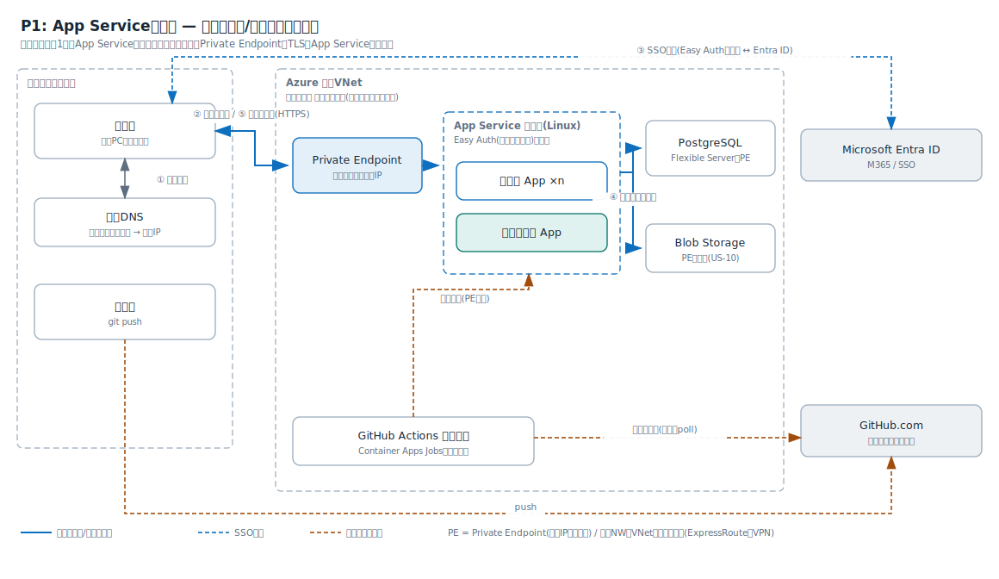
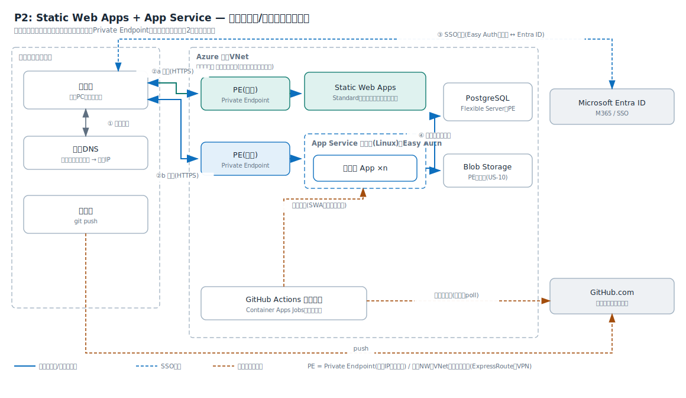
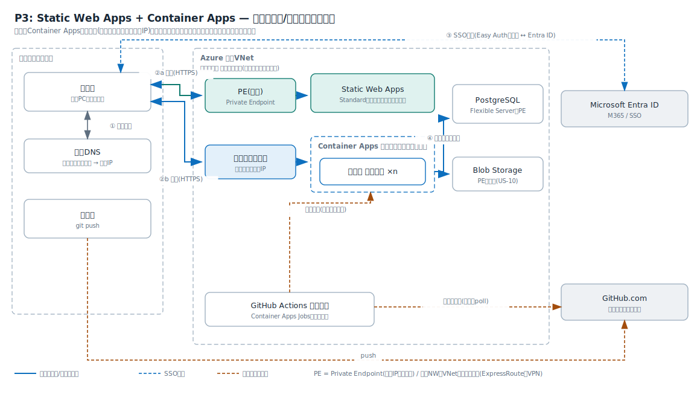
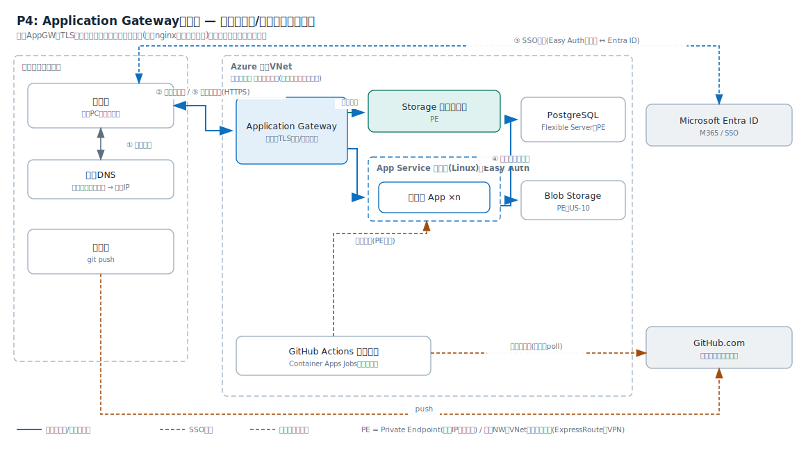

# 0001: アプリ公開基盤の環境パターン選定

状態: 起案(選択肢の列挙まで。決定は未記入)
日付: 2026-07-05
関連: docs/project/02_requirements.md(前提条件P-1〜P-6、検証マイルストーン)

## 背景

要件定義の前提は、社内閉域網内・全リソースプライベート・社内VNet接続・App Service証明書・GitHub.comからのpush起点デプロイ(標準)・予算20万円/6か月(ランニング月2万円級)・実装者1名である。第1段のゴールは「テンプレートから環境一式を短時間で用意できる」こと。この前提で静的基盤・動的基盤・共通部の実現方式を選ぶ。

## 選択肢

### 現行構成との対応(現行の各要素が何に置き換わるか)

| 現行要素 | 現行での役割 | Azureでの対応先(候補) | 補足 |
| --- | --- | --- | --- |
| nginx | TLS終端・ホスト名によるアプリ振り分け・静的配信 | 基盤側が吸収する。App Service・Static Web Appsではプラットフォームのフロントが同じ役割を担い、nginx自体は不要になる | nginxコンテナを持ち込むのはP5のみ。複数サイトの入口を1つに束ねたい場合だけApplication Gatewayを追加する(P4) |
| ap-xxxx(アプリ実行) | Dockerコンテナでアプリを稼働 | D1: App Service(1アプリ=1 App、1プランに相乗り)/ D2: Container Apps(1アプリ=1コンテナアプリ、環境を共有) | US-09の相乗りに対応 |
| PostgreSQL | 1インスタンスをDB分割で全アプリが共用 | DB1: Azure Database for PostgreSQL Flexible Server(プライベート接続) | 現行と同一製品。アプリ別DB分割(US-09-S2)も同じ方式 |
| Redis | セッション管理・SSO後のトークン格納 | 基盤の認証機能へ委譲(Easy Auth・Managed Identity)。アプリ独自キャッシュが必要な場合のみAzure Cache for Redis | Redisそのものは原則不要になる。US-07-S2で代替を確認 |
| ファイル保存(BLOB相当) | VMディスク・コンテナボリュームへの保存 | Azure Blob Storage(Storageアカウント+Private Endpoint) | 対応する要件ストーリーが未設定。検証に含めるならUS-10を追加する |
| ap-auth(認証) | M365 Graph APIでSSO、OAuthのメール送信 | Microsoft Entra ID+App Service組み込み認証(Easy Auth)、またはアプリ内でMSAL。メール送信はGraph APIを継続利用 | US-07で検証。共通認証コンポーネントを自作せず基盤機能に委譲できるかが論点 |

### 構成要素ごとの選択肢

**静的基盤(配信)**

| # | 方式 | 閉域対応 | 月額目安(概算) | 補足 |
| --- | --- | --- | --- | --- |
| S1 | Static Web Apps(Standard) | Private Endpoint対応 | 約1,400円/アプリ | GitHub連携内蔵。証明書は独自機構でP-5と齟齬 |
| S2 | Storageアカウント静的サイト | Private Endpoint対応 | 数百円 | 閉域でのカスタムドメインTLSに別途入口(AppGW等)が必要 |
| S3 | App Serviceに静的サイトを配置 | Private Endpoint対応 | プラン相乗りで追加費用ほぼゼロ | 動的と同一の仕組み。P-5とそのまま整合 |
| S4 | Container Appsでnginxコンテナ配信 | 内部イングレス対応 | 低額(従量) | コンテナ管理が増える |

**動的基盤(実行)**

| # | 方式 | 閉域対応 | 月額目安(概算) | 補足 |
| --- | --- | --- | --- | --- |
| D1 | App Service(Linux、1プランに複数アプリ相乗り) | VNet統合+Private Endpoint | B1で約2,000円/プラン | US-09の相乗りがプラン共有で自然。P-5と整合 |
| D2 | Container Apps(内部環境) | VNet内部環境 | 従量(アイドルほぼゼロ) | ゼロスケールで安い。証明書・ドメインは独自機構 |
| D3 | AKS(プライベートクラスタ) | 対応 | ノード代1万円超/月 | 1人検証には運用過剰 |
| D4 | Azure Functions | 対応(Premium以上で高額) | - | Next.js SSRに不向き |

**データ(共有基盤)**

| # | 方式 | 補足 |
| --- | --- | --- |
| DB1 | Azure Database for PostgreSQL Flexible Server(プライベート接続、B1ms) | 約3,000〜4,500円/月。1インスタンスにアプリ別DBを切る(US-09-S2)。現行と同一製品 |
| DB2 | PostgreSQLコンテナを自前運用 | 脆弱性対応の委譲という目的に反するため原則除外 |
| R1 | Azure Cache for Redis(Basic C0) | 約2,500円/月。基盤の認証機能(Easy Auth・Managed Identity)がセッション・トークンを代行するため原則不要。アプリ独自キャッシュが必要になった場合のみ追加 |
| R2 | Redisコンテナを自前運用 | DB2と同じ理由で原則除外 |

**CI/CD(GitHub.com → 閉域内へのデプロイ)**

| # | 方式 | 補足 |
| --- | --- | --- |
| C1 | GitHub Actions + セルフホストランナー(Container Apps Jobs) | ランナーを閉域内でジョブ実行時だけ起動。アイドル費用ほぼゼロ。有力 |
| C2 | GitHub Actions + セルフホストランナー(常駐VM) | 単純だがVM保守が復活し本末転倒気味 |
| C3 | GitHubホストランナー + デプロイ先の一時パブリック開放(IP制限) | 前提P-1(パブリック公開しない)に抵触。除外 |
| C4 | 手動デプロイ(az cli / zip) | P-3(手動デプロイは行わない)に抵触。第1段の緊急時の逃げ道としてのみ記録 |

### 組み合わせパターン

| パターン | 静的 | 動的 | CI/CD | 月額合計目安(概算) | 特徴 |
| --- | --- | --- | --- | --- | --- |
| P0: 現行VM(基準線) | VM+nginx | VM+Docker | 手動 | 現行実績値 | 比較のベースライン。US-06で数字を確定する |
| P1: App Service集約 | S3 | D1 | C1 | 1〜1.5万円 | 1系統で完結。P-5と完全整合。テンプレート最少 |
| P2: SWA+App Service | S1 | D1 | C1(SWAはGitHub連携) | 1.2〜1.7万円 | 静的の体験が良い。証明書・ネットワークが2系統 |
| P3: SWA+Container Apps | S1 | D2 | C1 | 1〜1.5万円(従量) | 目指す体験に最接近。作り込み最多。P-5と齟齬 |
| P4: Storage静的+App Service | S2 | D1 | C1 | AppGW追加で2万円超 | 静的最安のはずが入口装置で逆転する恐れ |
| P5: 全Container Apps | S4 | D2 | C1 | 1万円前後(従量) | 構成は一貫するが証明書・ドメインを自作する量が多い |
| P6: AKS集約 | - | D3 | - | 2万円超 | 本番大規模向け。検証では過剰として参考記載 |

共通事項: いずれのパターンもPostgreSQLはDB1、Private DNSゾーンとPrivate Endpoint(1個約1,100円/月)が付随する。Redis(R1)は基盤の認証機能が代行するため既定では作らない。月額は要精査であり、決定時に見積もりを確定させる。

### 共通で必要になるリソース(全パターン)

| リソース | 数 | 役割 | 月額目安(概算) |
| --- | --- | --- | --- |
| リソースグループ | 1 | 検証リソースの入れ物。撤去(US-06-S3)はグループ削除で行う | 0円 |
| 社内VNet(既存)のサブネット | 2〜3面 | PE用/VNet統合・ランナー用(P4はAppGW用を追加) | 0円 |
| Private DNSゾーン | 2〜4 | privatelink.postgres〜・redis〜・azurewebsites〜等の名前解決 | 約50円/ゾーン |
| PostgreSQL Flexible Server(B1ms) | 1 | 共有DB。委任サブネット接続ならPE不要 | 約3,000〜4,500円 |
| (任意)Azure Cache for Redis+PE | 0〜1 | アプリ独自キャッシュが必要な場合のみ。認証セッション・トークンは基盤が保持するため既定では作らない | 約2,500円+PE約1,100円(作る場合) |
| Blob Storage+PE(任意) | 1 | ファイル保存(US-10を追加する場合のみ) | 数百円+PE約1,100円 |
| Container Apps環境+Jobs | 1 | GitHub Actionsセルフホストランナー(都度起動) | ほぼ従量(アイドル約0円) |
| Entra IDアプリ登録 | アプリ数分 | SSO(US-07) | 0円 |
| App Service証明書 | 1 | カスタムドメインのTLS(前提P-5) | 年額約1万円 |

### パターン別の必要リソースと得失

**P1: App Service集約**

| 追加リソース | 数 | 役割 | 月額目安(概算) |
| --- | --- | --- | --- |
| App Serviceプラン(Linux B1) | 1 | 全アプリ+静的サイトの実行 | 約2,000円 |
| Web App | アプリ数+静的1 | 1アプリ=1 App。プランに相乗り | プラン内0円 |
| Private Endpoint | Web Appごとに1 | 受信の私設入口 | 約1,100円×個数 |

- 優位性: 証明書(P-5)・DNS・デプロイ手順が1系統でテンプレートが最小。相乗り(US-09)がプラン共有で自然。費用が固定で予算管理しやすい
- デメリット: PEがWeb Appごとに必要で、アプリ数に比例する費用(約1,100円/月×n)が残る。常時起動の固定費でゼロスケールなし。静的サイトに実行環境は過剰

**P2: Static Web Apps + App Service**

| 追加リソース | 数 | 役割 | 月額目安(概算) |
| --- | --- | --- | --- |
| Static Web Apps(Standard) | 静的サイト数 | 静的配信 | 約1,400円×数 |
| Private Endpoint(SWA用) | 静的サイト数 | 受信の私設入口 | 約1,100円×数 |
| App Service一式(P1と同じ) | - | 動的アプリの実行 | P1参照 |

- 優位性: 静的をアプリ実行環境から分離でき、静的サイト機能(ステージング等)が使える
- デメリット: 証明書・DNS・PE・手順書が2系統。SWAの証明書は独自機構でP-5と齟齬。P1より費用増

**P3: Static Web Apps + Container Apps**

| 追加リソース | 数 | 役割 | 月額目安(概算) |
| --- | --- | --- | --- |
| SWA一式(P2と同じ) | - | 静的配信 | P2参照 |
| Container Apps環境(内部) | 1 | アプリ実行。ランナーの環境と共用できる | 従量 |
| Container App | アプリ数 | 1アプリ=1コンテナアプリ。ゼロスケール | 従量(アイドル約0円) |
| Container Registry(Basic) | 1 | アプリのコンテナイメージ置き場 | 約700円 |

- 優位性: アプリ追加の限界費用がほぼゼロ(PE不要・従量)。夜間ゼロスケールで検証費用が最小。現行のDocker資産と親和。ランナーと環境を共用できる
- デメリット: 証明書がACA/SWAの独自機構でP-5と齟齬。ビルド→レジストリ→デプロイの作り込みが最多。従量で費用が読みにくい。内部イングレスのIPを社内DNSへ登録する運用が要る

**P4: Application Gateway集約**

| 追加リソース | 数 | 役割 | 月額目安(概算) |
| --- | --- | --- | --- |
| Application Gateway(Standard_v2・内部) | 1 | TLS終端・ホスト/パス振り分け(現行nginx相当) | 約2.5万円〜 |
| Storageアカウント静的サイト+PE | 1 | 静的配信 | 数百円+約1,100円 |
| App Service一式(P1と同じ) | - | 動的アプリの実行 | P1参照 |

- 優位性: 入口とTLS(証明書1枚)を一元化。パス分割のURL設計が自然。現行nginxと同型で概念の切り替えが少ない
- デメリット: AppGW単体で予算(月2万円)を超える固定費。構成要素が最多。検証フェーズには過剰。静的サイトへのSSO(US-07-S4)はStorage単体では実現できず作り込みが必要

P5(全Container Apps)はP3の静的をnginxコンテナ配信に置き換えた形で、追加リソースはP3とほぼ同じ。静的のためにコンテナを保守する分だけP3より手間が増えるため、P3が成立するならP5を選ぶ理由は薄い。

### 主要パターンのアーキテクチャ図(リクエスト→レスポンスの流れ)

現実的に採り得るP1〜P4を、利用者のリクエストの流れ(①名前解決 → ②HTTPSリクエスト → ③SSO認証 → ④データアクセス → ⑤レスポンス)とデプロイの流れ(push → ランナーの外向きpoll → デプロイ)で図にした。ベストプラクティスとして全パターン共通で次を採る。

- 受信はPrivate Endpoint+社内DNS。P3の動的のみ内部イングレス、P4はApplication Gatewayで入口を一元化
- PostgreSQL・Blob(・任意で追加するRedis)への接続はVNet内のプライベート接続に閉じる
- 認証はMicrosoft Entra IDへ委譲する(App Service組み込み認証)。ブラウザとEntra IDの間の通信だけがM365側に出る
- デプロイはVNet内のランナーがGitHub.comへ外向きにpollする。GitHubからのインバウンド開放はしない

**P1: App Service集約型** — 1系統で完結。TLSはApp Service証明書、静的サイトもAppとして同居

**P2: Static Web Apps + App Service** — 静的と動的を分離。入口(PE)と証明書が2系統になる

**P3: Static Web Apps + Container Apps** — 動的は内部イングレス。ゼロスケールで安いが証明書は独自機構

**P4: Application Gateway集約型** — 現行nginxに最も近い形。TLS終端と振り分けを一元化する代わりに装置の固定費が乗る

注意: いずれのパターンも、VNetからGitHub.comへの外向きHTTPS(ランナーのpoll)と、利用者ブラウザからEntra IDへの到達が前提になる。VNetからGitHub.comへの外向きアクセスは可能と確認済み(前提P-8)。インバウンドの開放はしない。

### 名前解決の仕組み(Private EndpointとDNS)

**補足: Private Endpoint(PE)とは。** AzureのPaaSサービス(App Service・DB・Storage)は、本来インターネット上の公開アドレスを持つ。PEを作ると、そのサービス専用の「社内向けの差し込み口」が社内VNetの中に私設IPで1つ生える。以後は社内からその私設IP経由でサービスに届き、公開側の入口は塞げる。現行構成でいえば「サーバーを社内LANにだけ接続する」ことのPaaS版で、これが前提P-1(パブリック公開しない)を実現する部品になる。1個あたり月額約1,100円(概算)。

Private Endpointを作ると、対象サービスのFQDN(例: app1.azurewebsites.net)は privatelink.azurewebsites.net への別名に変わる。これを私設IPへ解決するのはAzureの「Private DNSゾーン」で、VNetにリンクして使う。解決が自動で効く範囲は次のとおり分かれる。

- VNetの中(ランナー・アプリ間通信): Azureの既定リゾルバがPrivate DNSゾーンを参照し、自動で私設IPに解決される
- 社内ネットワークの利用者: 社内DNSが解決を担うため、AzureのPrivate DNSゾーンには直接届かない。次のどちらかを選ぶ
  1. 社内DNSに静的レコードを登録する: カスタムドメイン(例: app1.corp.example.com)→PEの私設IPのAレコードを手動登録する。アプリ追加時の登録作業はテンプレートの手順に含める。第1段はこれを推奨(追加費用なし)
  2. Azure DNS Private Resolverを置く: 社内DNSから条件付きフォワードでAzure側へ問い合わせる。登録が自動化できる代わりにエンドポイントの固定費が乗る(要精査)。本番展開でアプリ数が増えた時に再検討する

アーキテクチャ図の「① 名前解決」はこの仕組みを指す。

### 認証はどこで行われるか(ap-authの置き換え)

認証方式は 0002-auth-easyauth.md で「Easy Auth+Microsoft Entra ID(自作しない)」に決定済み。仕組みの詳細はそちらを参照。

Private Endpointは認証をしない。PEが守るのは「どの経路から届くか」だけで、届いた後の「誰か」の確認は別の層で行う。

- 全パターン共通で、認証は実行基盤の組み込み認証+Microsoft Entra IDで行う。未認証のリクエストは、アプリのコードに渡る前に基盤がEntra IDのログインへ誘導する(図の③)。現行ap-authのような独立した認証コンポーネントは立てず、基盤機能へ委譲する。リソース一覧に認証サーバーがないのはこのため(必要なのは無料のEntra IDアプリ登録のみ)
- 認証後のセッションはEasy AuthのCookieが、Graph API用トークンはEasy Authのトークンストア(利用者として送る場合)またはManaged Identity(システムとして送る場合)が扱う。現行Redisのセッション・トークン管理は不要になる(US-07-S2で確認)。メール送信はアプリからGraph APIを呼ぶ
- 組み込み認証の機構はApp Service(Easy Auth)・Static Web Apps・Container Appsでそれぞれ別物になる。P2・P3のように基盤が2系統になると認証設定も2系統になり、証明書と同じく「系統数」の論点に含まれる
- 静的サイトにもサイト単位でSSOをかける(US-07-S4)。実現手段はパターンで差が出る: P1は動的と同一機構(Easy Auth)でそのまま適用できる。P2・P3のSWAは組み込み認証を持つが動的側とは別機構になる。P4のStorage静的サイトは単体で認証できず、Application GatewayにもSSO機能がないため作り込みが必要になる

### 絞り込みの観点(決定時に使う)

1. 前提P-5(App Service証明書)との整合 — P1・P2・P4は整合、P3・P5は証明書機構が別
2. 第1段ゴール(テンプレートで環境がすぐできる)への近さ — 系統数が少ないほど有利
3. 予算(月2万円級)内での費用の予見性 — 固定費のApp Service系は読みやすく、従量のACA系は安いが読みにくい
4. US-09(複数アプリ相乗り)の自然さ — App Serviceプラン共有、ACAは環境共有で対応
5. 現行構成(nginx+PG+Redis+n個アプリ)からの概念の近さ — 移行判断のしやすさ
6. 静的サイトへのSSO(US-07-S4)の実現しやすさ — P1は動的と同一機構、P2・P3は別機構(SWA組み込み認証)、P4は作り込みが必要

## 決定

未定。パターンの精査(費用見積もり・構築手数の比較)後に記入する。

## 理由

決定後に記入する。

## 捨てた案とその理由

決定後に記入する。現時点で除外が確定しているのは C3(P-1抵触)・C4(P-3抵触、逃げ道としてのみ)・DB2/R2(保守委譲の目的に反する)・P6(検証規模に過剰)。
