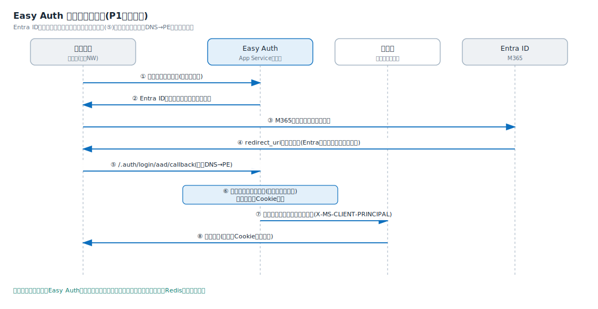
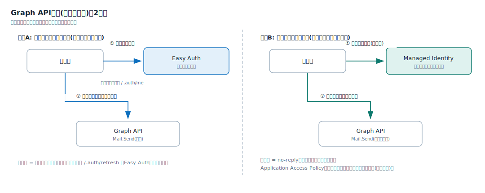

# 0002: 認証方式の選定(Easy Auth + Microsoft Entra ID)

状態: 決定済み
日付: 2026-07-05
関連: docs/project/02_requirements.md(前提P-7、US-07)、0001-select-hosting-pattern.md

## 背景

現行構成では独立コンポーネントap-authがM365 SSO・トークン管理・OAuthのメール送信を担い、セッションとトークンはRedisに格納している。新基盤ではこの自作をやめて基盤機能へ委譲できるかが論点だった(ADR-0001の認証節)。前提は社内閉域網・M365テナント(Entra ID)の利用。

## 選択肢

- 案1: ap-authをコンテナのまま新基盤へ移植する。実績はあるが、認証コードとRedisの保守が残り、PaaS化の目的(保守の委譲)に反する
- 案2: 各アプリ内でMSAL等のライブラリを使い認証を実装する。柔軟だが、アプリ数に比例して実装・シークレット管理・更新が増える
- 案3: 基盤の組み込み認証(Easy Auth)+Entra IDに委譲する。アプリのコード変更ほぼ不要で、セッション・トークン管理も基盤が代行する

## 決定

案3を採用する。認証はEasy Auth(App Serviceの組み込み認証)+Microsoft Entra IDで行い、認証コンポーネントは自作しない。要件定義の前提P-7に反映した。

## 理由

- アプリにSDKや認証コードを入れずに、テンプレートの設定だけで全アプリへ同じ認証を適用できる。「テンプレートから環境がすぐできる」という第1段のゴールに直結する
- セッション(Cookie)とトークン(トークンストア)の管理を基盤が代行し、現行Redisのセッション・トークン用途が不要になる
- Redirect URIの解決は通常アクセスと同じ仕組み(社内DNS→Private Endpoint)に乗るため、閉域網でも成立する。Entra IDが閉域内へ通信することはない

## 仕組み

### ログインの流れ

Easy Authはアプリの手前に基盤が挟む「認証の門番」で、全リクエストがアプリのコードに届く前にこの層を通る。

1. 未ログインの利用者がアプリへアクセスする(社内DNS→PE経由)
2. Easy AuthがセッションCookieの無いことを確認し、ブラウザをEntra IDへリダイレクトする
3. 利用者がM365アカウントでログインする(ここだけM365側への通信)
4. Entra IDはブラウザへ「redirect_uri(/.auth/login/aad/callback)へ戻れ」と指示するだけで、閉域内のアプリへは一切通信しない
5. ブラウザが社内DNS→PE経由でcallbackへ戻る
6. Easy Authがトークンを検証・保管し、セッションCookie(AppServiceAuthSession)を発行する
7. 以降のリクエストは、利用者情報をヘッダー(X-MS-CLIENT-PRINCIPAL)に付けてアプリへ転送される
8. アプリはヘッダーを読むだけで利用者を識別できる。ログイン処理のコードは書かない

Redirect URIはEntra IDのアプリ登録に「文字列として」事前登録するだけで、Entra側から到達可能である必要はない。

### セッションとトークンの管理(Redisが不要になる理由)

| 管理対象 | 現行(ap-auth+Redis) | 新基盤(Easy Auth) |
| --- | --- | --- |
| ログインセッション | Redisに格納 | Easy AuthのセッションCookie+内部ストアが保持 |
| SSO後のアクセストークン | Redisに格納 | Easy Authのトークンストアが暗号化保管。アプリはヘッダーか /.auth/me で取得 |
| トークンの更新 | ap-authが実装 | /.auth/refresh を呼ぶとEasy Authがリフレッシュトークンで更新 |

Redisが残る用途はアプリ独自のキャッシュ・一時データのみで、現行の利用がセッション+トークンに限られるため、新基盤では既定で設けない(必要になったアプリが出た時に追加する)。

### Graph API連携(メール送信)

| | 方式A: 利用者本人として送る | 方式B: システムとして送る |
| --- | --- | --- |
| 許可の種類 | 委任アクセス許可(Mail.Send) | アプリケーション許可(Mail.Send) |
| トークンの入手先 | Easy Authのトークンストア(ログイン時に Mail.Send+offline_access を要求) | Managed Identity(その場で取得。保存しない) |
| 差出人 | ログイン中の利用者 | no-reply等のサービス用メールボックス |
| 向く場面 | 利用者の操作起点の送信 | 通知メール・バッチ送信 |
| 統制上の注意 | 利用者の権限の範囲内 | テナント全体の送信権限になるため、Application Access Policy(Exchange Online)で送信可能なメールボックスを限定する(必須) |

現行ap-authの送信がどちらの方式かは確認中。確認結果に応じてUS-10(メール送信)の要否と方式を決める。

### 複数アプリと静的サイト

- 複数アプリ(US-09): セッションCookieはアプリごとに独立する(US-09-S3)。ただしEntra ID側のログインセッションが効くため、2つ目以降のアプリはサイレント認証で自動的にログインが通り、利用者の操作は実質1回で済む
- 静的サイト(US-07-S4): P1(App Service集約)では静的サイトもAppのため、同じEasy Authをサイト単位で有効/無効にできる

## 捨てた案とその理由

- 案1(ap-auth移植): 認証コード・Redis・コンテナの保守が残り、IaaS保守の委譲という企画の目的に反する
- 案2(アプリ内MSAL実装): アプリ数に比例して実装とシークレット管理が増える。将来のID/パスワード認証(派遣社員向け、要件定義の将来検討)を扱う際に部分的に再評価する

注: Easy AuthはApp Service系の機能。ADR-0001でP3(Container Apps)系を選ぶ場合は、同等の組み込み認証機能に読み替える(決定の趣旨=「認証は自作せず基盤へ委譲」は変わらない)。
