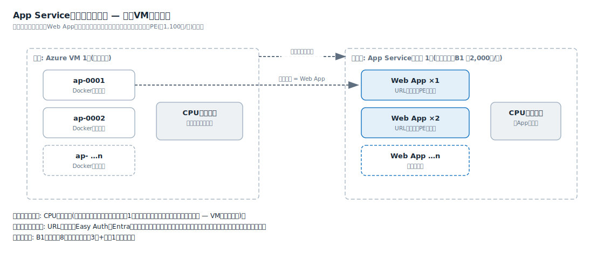

# 解説ノート: App Serviceプランの考え方(1つの契約で複数アプリを動かす)

日付: 2026-07-05
関連: 0001-select-hosting-pattern.md(P1)、02_requirements.md(US-09)、notes/authorization.md

App Serviceの課金単位は「App Serviceプラン」(計算資源のひとかたまりの契約)で、その上に**Web App(アプリ)を複数載せられる。アプリの追加は無料**である。現行VM運用の「1台にコンテナを詰め込んで密度で元を取る」経済性が、そのままプランで再現できる。US-09(相乗り)はこの仕組みで実現する。

## 現行VMとの対応

| 現行(VM運用) | App Service |
| --- | --- |
| Azure VM 1台 | App Serviceプラン 1つ(課金単位。B1 約2,000円/月) |
| Dockerコンテナ ×n | Web App ×n(追加無料) |
| コンテナごとの設定 | Web Appごとの独立したURL・設定・Easy Auth・Entra登録・デプロイ |

## 共有されるものと独立しているもの

- **共有(プラン単位)**: CPU・メモリ。スケールアップ(B1→B2)はプラン単位で、1つのアプリの高負荷は同居アプリに影響する。VM内のコンテナと同じ性質
- **独立(Web App単位)**: URL・設定・Easy Auth・Entra IDアプリ登録・デプロイ。資源は相乗りで安く、認証と権限はアプリごとに分けられる。「1業務アプリ=1 Web App=1アプリ登録」の1:1を保てる根拠(認可の使い分けは notes/authorization.md)

## 費用と密度

- アプリを追加して増える費用は**Private Endpoint(約1,100円/月)だけ**。プラン・Web Appの追加費用はゼロ
- 密度の目安はB1で数個〜8個。検証アプリ3本+静的サイト1本は余裕
- 詰め込みすぎて遅くなったら、アプリを別プランへ移すかプランをスケールアップする。この判断も現行VMの増強判断と同じ感覚でできる
