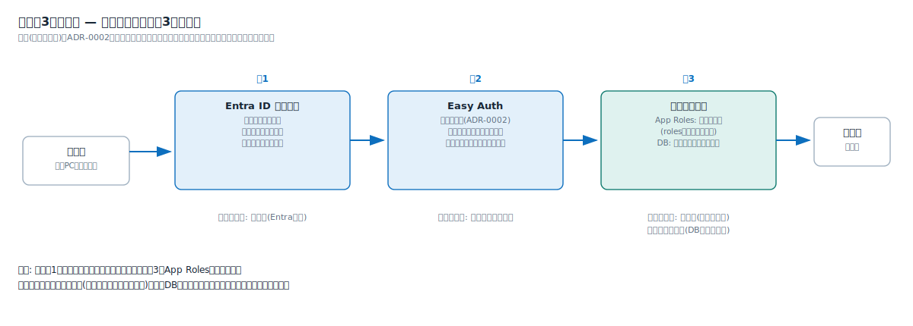

# 解説ノート: 認可の考え方(誰が閲覧・操作できるか)

日付: 2026-07-05
関連: 0002-auth-easyauth.md(認証)、02_requirements.md(US-07、権限マトリクス)

認証(誰であるか)はADR-0002でEasy Auth+Entra IDに決定した。本書はその先の認可 — 誰が閲覧・操作できるかをどこで制御するか — を整理する。

## 3層モデル

| 層 | 場所 | 制御する内容 | 変えるのは誰 |
| --- | --- | --- | --- |
| 層1 | Entra ID 割り当て | アプリ単位の名簿。「割り当てが必要=はい」にすると、割り当てのない人はログイン自体が失敗する。全社員に開くなら「いいえ」 | 情シス(Entra管理) |
| 層2 | Easy Auth | 未認証・他テナントのアカウントを拒否する(ADR-0002) | テンプレートの設定 |
| 層3 | アプリ内認可 | App Roles(機能ロール)またはDB(業務データ依存の権限) | 情シス(ロール割当)または業務部門(DBの管理画面) |

指針: まず層1で「入れる人」を絞り、機能の役割は層3のApp Rolesで表現する。業務データに連動する権限だけをDBに持たせ、権限テーブルの自作を最小にする。

## 静的コンテンツの認可

静的サイトにはコードがないため、層3は使えない。層1(Entra割り当て)で完結させる。一律権限(見られるか見られないか)しか要らない静的サイトには、これで必要十分になる。サイト単位のSSO有効/無効はUS-07-S4で検証する。

## App Rolesの仕組み

App Rolesは「アプリ登録ごとに定義する、そのアプリ専用のロール辞書」である。アプリAの`Admin`とアプリBの`Admin`は別物で、同じ人がAでAdmin・BでViewerという割り当てもできる。

1. **定義**(アプリ登録側): そのアプリ専用のロールを任意の名前で定義する(例: `Admin` / `Approver` / `Viewer`)。各ロールはvalue(トークンに入る文字列)を持つ
2. **割り当て**(エンタープライズアプリケーション側): 誰がどのロールかをユーザー単位またはグループ単位で割り当てる。1人に複数ロールも可
3. **利用**(アプリ側): ログイン時にトークンの`roles`クレームへ割り当てロールが入る。Easy Auth経由なら`X-MS-CLIENT-PRINCIPAL`ヘッダーで届くため、アプリは「rolesにApproverが含まれるか」を見るだけ。権限テーブルも権限管理画面も自作不要

制約: ロールは静的な辞書で、追加・変更はアプリ登録の更新(情シス側の操作)になる。業務データに連動する動的な権限には向かない。

注意: グループ単位のロール割り当てはEntra ID P1ライセンス以上が必要(個人単位は無償枠で可)。テナントのライセンスは要確認。

## Entra IDで持つ権限とDBで持つ権限の使い分け

| | Entra ID(App Roles) | DB(アプリ内) |
| --- | --- | --- |
| 向くケース | 役割が少数で安定(管理者/承認者/一般)。機能単位の制御 | 役割が業務データに結びつく(例: 備品カテゴリごとの承認者)。レコード単位の制御 |
| 誰が変える | 情シス・Entra管理者。監査もEntra側に一元化 | 業務部門がアプリ画面から付け替える |
| アプリの実装 | rolesクレームを読むだけ | 権限テーブルと管理画面を自作 |

まずApp Rolesで表現できないかを考え、「業務部門が画面から権限を変えたい」「レコード単位で効かせたい」が出た部分だけDBに持つ。

## アプリ登録と業務アプリの対応(1:1を保つ)

App Roles・層1の名簿は**アプリ登録単位**で働く。1つのWeb Appに複数の業務アプリを同居させる(1:n)と、次の制約を受ける。

- 入口制御が全業務一括になり、「業務Aは総務部だけ、業務Bは全社員」という見せ分けができない
- ロール辞書が1冊に混在し、誰がどの業務の権限を持つかの棚卸しがしにくくなる
- Easy Auth設定・セッションも共通になる

指針: **見せる相手が業務ごとに違うなら、Web Appを分けて「1業務アプリ=1 Web App=1アプリ登録」の1:1を保つ**。App Serviceプランの相乗りではWeb Appが業務アプリごとに分かれるため、この1:1は自然に保たれる(解説ノート「App Serviceプランの考え方」を参照)。1:1を保つ追加費用はPE(約1,100円/月)だけである。

## 要件との対応

- 権限マトリクス(02_requirements 非機能要件)の「公開アプリの閲覧」= 層1で制御する
- 「デプロイ・基盤構成の変更・リソース削除」= アプリの認可ではなく、Azureリソース操作の権限(Azure RBAC)で制御する。基本設計(04)で扱う
- 本検証のスコープはUS-07(入口の認証)まで。App Roles・DB認可は本番アプリの設計時の論点として本書に記録しておく
