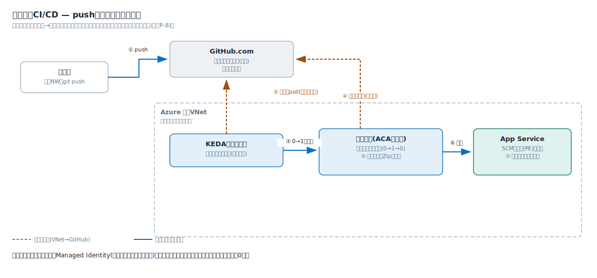
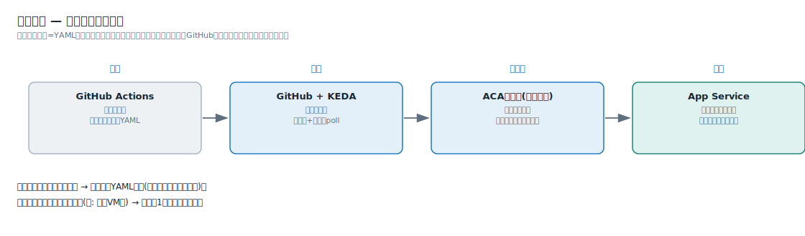

# 解説ノート: 閉域でのCI/CDの考え方

日付: 2026-07-05
関連: 02_requirements.md(P-3、P-8、US-01〜04)、0001-select-hosting-pattern.md(C1)、notes/app-service-plan.md

pushから公開までの自動化(P-3)を、パブリック公開なしの閉域網(P-1)でどう成立させるかを整理する。前提はP-8(VNetからGitHub.comへの外向きHTTPSは許可、インバウンドは開放しない)。

## なぜ「普通の自動デプロイ」が使えないか

App Serviceにはデプロイセンター(GitHub連携の自動デプロイ)があるが、その実行役は**GitHubのクラウド上のランナー**で、パブリックインターネットからApp Serviceのデプロイ受け口(SCMエンドポイント)へ届ける仕組みである。本件では受け口もPrivate Endpointの内側に入るため、パブリックからは届かない。デプロイ時だけ受け口を公開する案(ADR-0001のC3)はP-1に抵触するため除外した。

結論: **デプロイの実行役を壁の内側(VNet内)に置く**。これがセルフホストランナー(ACAジョブ)の役目である。

## 原則: 押し込みではなく引き取り

閉域にWebhook(押し込み)は届かない。代わりに、**すべての通信を「内→外」の引き取りで組む**。

- 見張り役は**KEDA** — 「仕事の在庫を見て、コンテナの数を0〜nに増減させる自動係」。OSSだがACAに組み込み済みで、設定だけで使える
- KEDAが数十秒おきに外向きHTTPSでGitHubのジョブキューを確認し、仕事がある時だけランナーを起動する。空振りなら起動もしない
- GitHubから閉域内への接続は一度も発生しない。ランナー自身のジョブ受領も外向き接続で行う

## 全体の流れ

1. 開発者がpushする。GitHubがワークフローのジョブをGitHub側のキューに積む(この時点で閉域内には何も届かない)
2. VNet内のKEDAスケーラーが外向きpollでキューを確認する
3. 仕事を見つけたら、ランナーのコンテナを0→1で起動する
4. ランナーが外向き接続でコードとジョブ内容を取得する
5. コンテナ内でビルドし、成果物をZipに固める
6. `az webapp deploy` でZipをApp ServiceのSCM受け口へ搬入する。受け口はPrivate DNS→PEの私設IPで解決されるため、VNet内のランナーからだけ届く
7. App Serviceが展開・再起動する(ここは全自動。ランナーの仕事は「届けたら終わり」)
8. ジョブが終わるとランナーは消えて0に戻る。待機中の費用は約0円

デプロイ権限は**ランナーのManaged Identity**にRBACで与える。GitHubにもコンテナにもシークレットを保存しない — ランナーがAzureの中にいるからこそ使える手で、この構成の隠れた利点である。

## 役割分担 — 頭脳と体は疎結合

| 役割 | 担当 | 例え |
| --- | --- | --- |
| 何をするか(手順書) | GitHub Actionsのワークフロー(リポジトリ内のYAML) | 台本 |
| いつ動くか(検知) | GitHubのキュー+KEDAの外向きpoll | 演出家 |
| どこで動くか(実行環境) | ACAジョブのランナー(使い捨て・実行秒課金) | 呼ばれた時だけ現れる舞台 |
| どこで公開するか | App Service(展開・再起動は自動) | 本番の劇場 |

疎結合の利点: パイプラインの変更はYAMLを直すだけでACA側は無関係。逆にランナーの置き場を変えても(例: 常駐VM化)台本は1行も変わらない。GitHubを別のGitサービスに替えても、作業場の仕組みは流用できる。

## なぜランナーの置き場がACAジョブか(代替との比較)

| | ACAジョブ | Azure Functions | 常駐VM | AKS |
| --- | --- | --- | --- | --- |
| 実行時間の上限 | 実質なし | 従量プランは最大10分。ビルドが収まらない | なし | なし |
| 実行環境 | 任意のコンテナを丸ごと実行 | 関数コード専用。ランナーの同居に不向き | 自由 | 自由 |
| GitHubキュー連携 | KEDAスケーラーが組み込み | なし(自前実装になる) | 常駐エージェント | KEDA(自前運用) |
| 待機中の費用 | 約0円(0にスケール) | 0円だが上記制約で不成立 | VM代が常時発生 | ノード代が常時発生 |
| 保守 | なし | - | OSパッチが復活(本末転倒) | クラスタ運用(過剰) |

エフェメラルなジョブ実行環境としてはACAジョブが最有力。ただし利用者向けアプリの基盤としては別の評価になる(ADR-0001。証明書P-5・Easy Auth・即応答の要件でApp Serviceに軍配)。「アプリはApp Service、裏方ジョブはACA」という適材適所に落ち着く。

## 運用の注意

- **反映のラグ**: pushから起動まで数十秒(ポーリング間隔+コンテナ起動)。デプロイ用途では問題にならないが、即時Webhookの感覚ではない
- **暴走対策は必須**: 従量課金はジョブがハングすると課金が続く。**ジョブのタイムアウトと同時実行数の上限をテンプレートに必ず入れる**(US-06-S2の予算監視とセットで効く)
- **成立条件はP-8のみ**: VNet→GitHub.comの外向きHTTPS。確認済み
