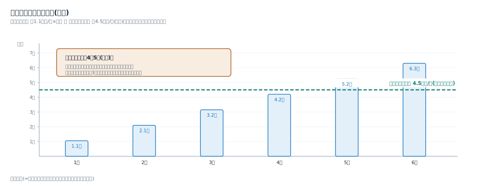
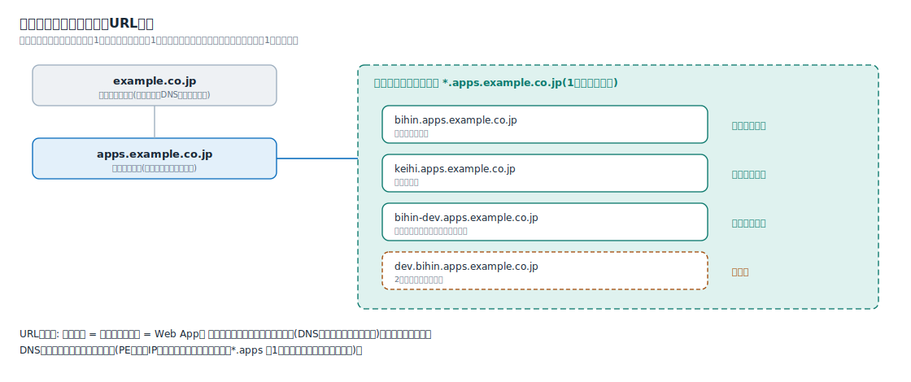

# 解説ノート: DNSとSSL証明書の考え方

日付: 2026-07-05
関連: 02_requirements.md(P-5、確認事項2)、0001-select-hosting-pattern.md(名前解決の節)、notes/app-service-plan.md

アプリを増やしたときにDNSと証明書の費用・作業がどう増えるかを整理する。結論を先に書くと、**DNSはほぼ固定費、証明書はワイルドカード契約にすれば固定費**になり、アプリ追加の増分費用はPE(約1,100円/月)だけを維持できる。

## DNSの考え方

- **Azure側(Private DNSゾーン)**: privatelink系のゾーンは全Web App共通で、アプリを増やしてもゾーンは増えない。増えるのはゾーン内のレコードだけで、レコード追加の費用は実質ゼロ。ゾーン自体は約50円/月×数個
- **社内DNS側**: アプリ追加ごとにAレコード1行(カスタムドメイン→PEの私設IP)。自社運用のため費用ゼロ。テンプレートの手順に含める
- 注意: **DNSレコードはアプリごとに必要**。PEの私設IPがアプリごとに異なるため、ワイルドカードのDNSレコード(`*.apps`→1つのIP)で済ませることはできない。証明書は1枚に集約できてもDNSは1行ずつ、と覚える

## SSL証明書: 単一ドメイン契約とワイルドカード契約

前提P-5のとおりApp Service証明書を使う(無料のマネージド証明書は、発行時にアプリへのパブリックアクセスが必要なため閉域では使えない)。契約形態は2つある。

| | 単一ドメイン契約 | ワイルドカード契約 |
| --- | --- | --- |
| カバー範囲 | 1ドメイン(例: bihin.apps.example.co.jp)につき1枚 | `*.apps.example.co.jp` の第1階層すべてを1枚で |
| 年額(概算・要精査) | 約1.1万円/枚 | 約4.5万円 |
| アプリ追加のたびに | 1枚ずつ購入・検証・割り当てが増える | 何もしない(既存の1枚を割り当てるだけ) |
| ドメイン所有検証 | 枚数分のレコードを維持 | 1つだけ維持 |
| 更新失敗のリスク箇所 | 枚数に比例 | 1か所 |

**単価の分岐点は4〜5個(概算)**。単一×4枚=約4.2万円がワイルドカード約4.5万円とほぼ並び、5個からは逆転する。ただし検証レコードの管理・更新失敗のリスク・割り当て作業が枚数に比例する運用面を加味すると、アプリが増える計画があるなら**3個前後からワイルドカードが実質有利**。本件は「今後アプリの公開先が複数必要になる」ことが企画の前提なので、ワイルドカード契約を推奨する。

## ワイルドカード契約時のURL設計

- **基盤専用の親サブドメインを1つ切る**(例: `apps.example.co.jp`)。会社ドメイン直下の `*.example.co.jp` を1枚でカバーするのは影響範囲が広すぎるため避ける
- **アプリは第1階層に並べる**: `bihin.apps.example.co.jp`、`keihi.apps.example.co.jp`
- **ワイルドカードが守るのは1階層だけ**。`dev.bihin.apps.example.co.jp` のような2階層下は対象外になるため、環境の区別はハイフンで同一階層に置く(`bihin-dev.apps.example.co.jp`)
- 親の名前そのもの(`apps.example.co.jp`)もワイルドカードの対象外。ポータルを置くなら別途1枚か、名前を第1階層に置く(`portal.apps.example.co.jp`)
- 命名規約: **アプリ名=サブドメイン名=Web App名**に揃えると、テンプレートの手順(DNS登録・証明書割り当て・Entra登録)を機械的にできる

## 自動ローテーション(自動更新)の判断

App Service証明書はKey Vaultに格納され、自動更新をONにすると、更新された証明書は同じシークレットの新バージョンとして入り、各Web Appが自動で追従する(定期同期・再起動不要)。

| | 自動更新する | 自動更新しない(手動) |
| --- | --- | --- |
| 失効リスク | 構造的に防げる(更新忘れが起きない) | 更新忘れ=全アプリ停止のリスクを毎年抱える |
| 作業 | ゼロ(監視のみ) | 毎年の更新・割り当て作業。単一契約なら枚数分 |
| 統制 | 更新タイミングを選べない。請求が自動継続 | 変更管理に載せて計画更新できる。検証環境で先行確認できる。契約をやめる判断の機会が毎年ある |
| 向くケース | 本件を含むほぼすべて | 変更統制が厳格で、失効監視の体制が別にある場合のみ |

推奨は**自動更新ON+監視**。監視項目は1つに集約される: ドメイン所有検証(パブリックDNS側の検証レコード)が生き続けているか。これが切れると自動更新が止まる。Runbook(運用準備)にこの1行を入れる。

## 費用まとめ(アプリを増やしたときの増分)

| 項目 | アプリ追加時の増分 |
| --- | --- |
| DNS(社内・Azure) | 0円(Aレコード1行の作業のみ) |
| SSL証明書(ワイルドカード契約) | 0円(既存の1枚を割り当て) |
| Private Endpoint | 約1,100円/月 |
