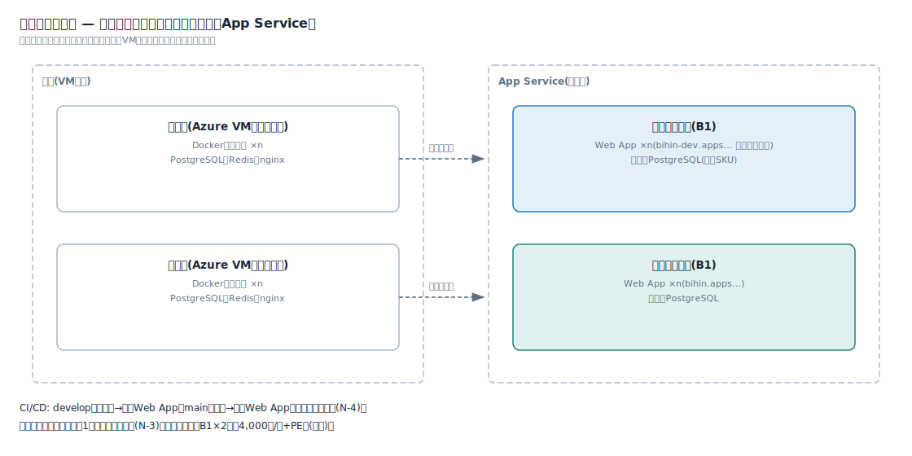

# 解説ノート: 環境構成の考え方(検証と本番の並行運用)

日付: 2026-07-05
関連: notes/app-service-plan.md(N-2)、notes/dns-ssl.md(N-3)、notes/cicd.md(N-4)

現行は開発(ローカル)・検証機(Azure VM)・本番機(Azure VM)の3層で、検証機と本番機は常時並行で稼働している。この形をApp Serviceへ写像する。

## 現行との対応

| 現行 | App Serviceでの対応物 |
| --- | --- |
| 開発(ローカル) | 変わらない。ローカルで動くアプリがそのままデプロイ対象になる |
| 検証機(VM・常時稼働) | 検証用プラン(B1)+検証用Web App ×n |
| 本番機(VM・常時稼働) | 本番用プラン(B1)+本番用Web App ×n |

## 環境別プランにする理由(隔離)

- プランを環境別に分けることで、「検証の負荷が本番に影響しない」という現行のVM分離と同じ隔離を保つ
- 同一プランへの検証・本番の相乗りはプラン代が半分になるが、この隔離が失われるため、常時並行運用では採らない
- 費用はB1×2で約4,000円/月+PE類(概算)。VM2台の保守込みコストより軽い。Private Endpointを使う構成のため、B1が実質の最小SKUで「検証だけ無料枠」のような節約はできない

## URL・証明書・認証

- URL: 本番 `bihin.apps.example.co.jp`、検証 `bihin-dev.apps.example.co.jp`(ハイフンで同一階層に置く規約。N-3)
- 証明書: ワイルドカード1枚を両環境のWeb Appで共用する(N-3の「環境を跨いだ利用」)
- 認証: Easy AuthとEntra IDの割り当ては環境別に設定できる。検証環境はレビュー担当だけに割り当てて見せる相手を絞れる(N-1の層1)

## データベース

- 現行と同型なのは、検証用・本番用のPostgreSQL Flexible Serverを分けること(検証側は最小SKU)
- 節約案として1インスタンス内で検証DB・本番DBを分離する形もあるが、本番のバックアップとメンテナンス時間の独立性を考えると、本番展開時はインスタンス分離が無難

## CI/CD(ブランチで振り分け)

- developブランチへのpush→検証Web App、mainへのマージ→本番Web App。ワークフローYAMLの書き分けだけで実現し、ランナー(N-4)は共用のまま増えない
- 環境ごとの設定差(DB接続先)は、Web Appごとのアプリ設定(環境変数)に持たせる

## スロットの位置づけ

- 常設の検証環境がある運用では、デプロイスロットは「検証環境の代替」ではなく「本番プラン内のリリース関所」という別の役割になる(Standardプラン以上が必要)
- 完成形は併用: 機能確認・利用部門レビュー=常設の検証Web App → リリース判定の最終確認と瞬間切替=本番のstagingスロット
- 本検証フェーズは常設の検証Web App方式だけで進める

## 利用部門(お客さん)のレビュー

- 検証Web AppのURLを案内し、Entra IDの割り当てで見せる相手を絞る
- スロット方式との違い: スロットは「レビューされた実体がそのまま本番に入れ替わる」ことを構造的に保証する。別Web App方式は同じコードを本番へ再デプロイするため厳密には別の実体になるが、通常の社内システムではこれで十分
